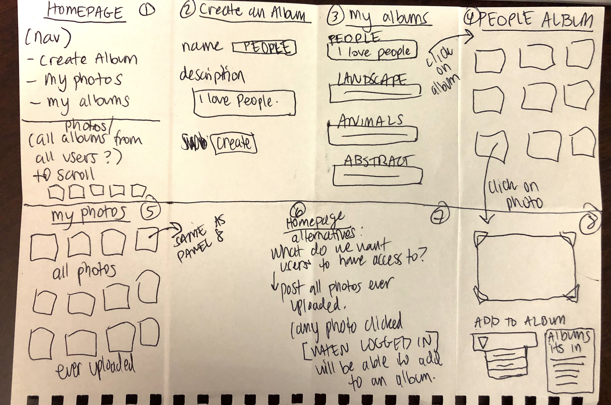
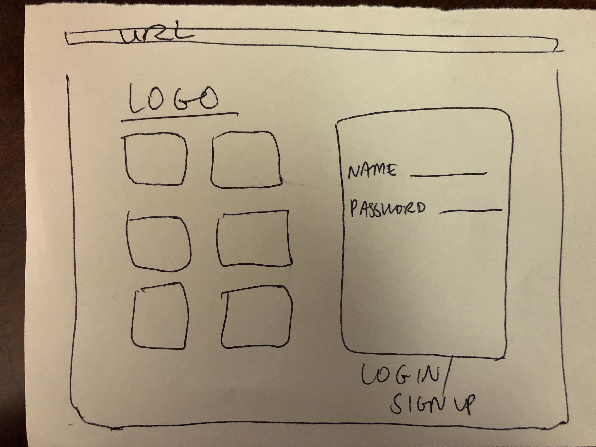
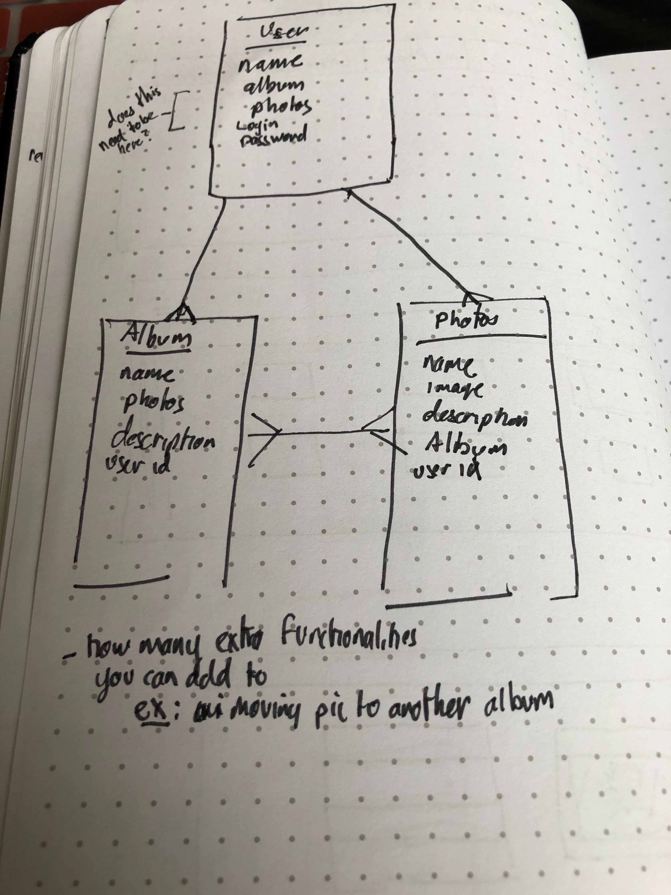

# Project2
Albums & Photos

## Index

* [User Stories](#User-Stories)
* [Wireframes](#Wireframes)
* [ERD](#ERD)
* [Technologies](#Technologies)
* [Stretch Goals](#Stretch-Goals)

## User Stories
1. Upon going to site homepage, user will be prompted to create an account or sign into account. Site visitors will be able to sign up and log in to their homepage
2. User profile page should contain: Username, email, password, description, Edit profile
3. User can upload pictures to his or her account
4. Users will be able to create, edit, delete their albums. User can organize photos into albums
5. For each album, user can add existing photos into it. Albums, when clicked by user, will display grid of pictured added by user
6. User can then click on image to view details of picture
7. User can update, remove, or "copy" image to new album
8. Photos page should contain: NameDateDescriptionEdit photos detailsDelete photoSave/move to Album xxx
9. Albums page should contain: Name Description Edit album detail Delete album Add a photo

## Wireframes

## ERD

## Technologies
Python | Django | AJAX | HTML | CSS | JavaScript | Bootstrap 

## Stretch Goals
1. Add other people's pictures to a user created album
2. search bar
3. home page upgrade (display all photos in database, like pinterest)
4. use external APIs
